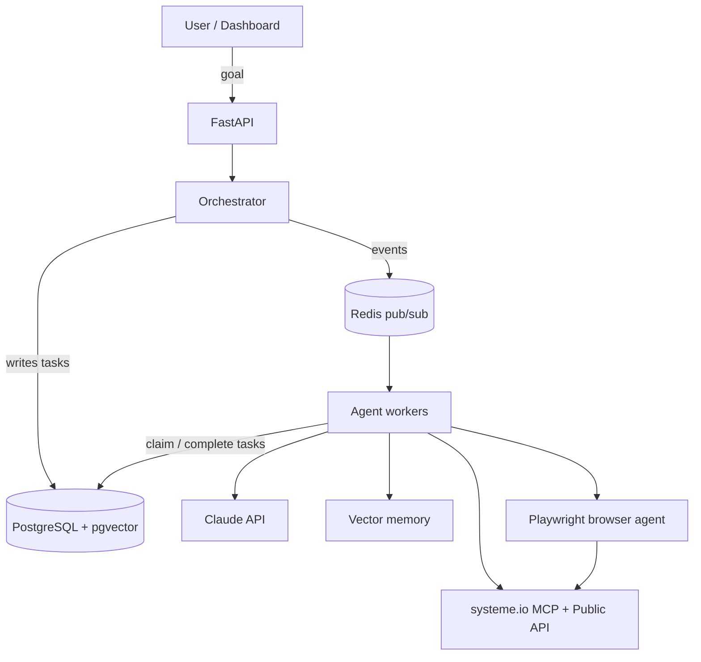

# AI Business Operator

An autonomous multi-agent system that researches a market, creates a digital product, and
designs, builds, and launches a complete marketing funnel in [systeme.io](https://systeme.io).

A master **Orchestrator (CEO)** agent receives a user goal and decomposes it into tasks for a
team of specialists — Market Research, Product, Branding, Copywriting, Email, Funnel,
Automation, Browser, Analytics, and Optimization. Agents never call each other directly; they
claim tasks from a shared Postgres table and emit events on Redis.

> **Status: Phase 1 → Phase 2 scaffold.** This repository is the skeleton described in the
> architecture specification. Interfaces, schemas, and wiring are real; agent reasoning and the
> systeme.io write paths are deliberately stubbed and marked `TODO(phase-N)`. See
> [`docs/roadmap.md`](docs/roadmap.md).

## Layout

| Path | What lives here |
|---|---|
| `backend/` | FastAPI API + orchestrator service, SQLAlchemy models, systeme.io client |
| `agents/` | Base agent framework, worker loop, and one folder per specialist agent |
| `browser_agent/` | Playwright automation for systeme.io UI work the API doesn't expose |
| `vector_memory/` | Embedding wrapper and pgvector-backed long-term memory store |
| `frontend/` | Next.js + Tailwind dashboard |
| `infra/` | docker-compose, database init SQL, Kubernetes manifests, Terraform |
| `docs/` | Architecture, developer guide, systeme.io integration, security, roadmap |
| `CLAUDE.md` | Project context and guardrails for Claude Code |
| `AGENTS.md` | Subagent definitions (purpose, tools, memory scope, failure modes) |

## Quick start

```bash
cp .env.example .env          # fill in ANTHROPIC_API_KEY, SYSTEMEIO_* keys, JWT_SECRET
make up                       # postgres + redis + backend + a worker
make migrate                  # apply infra/sql/001_init.sql
make test                     # backend pytest suite
open http://localhost:8000/docs
```

The frontend runs separately:

```bash
cd frontend && npm install && npm run dev   # http://localhost:3000
```

`make` targets are thin wrappers around docker compose — see the [Makefile](Makefile) and
[`docs/developer_guide.md`](docs/developer_guide.md).

## Architecture at a glance



Full diagrams and component descriptions: [`docs/architecture.md`](docs/architecture.md).

## Safety rails worth knowing before you run it

- **Nothing publishes without a human.** `REQUIRE_HUMAN_APPROVAL=true` (the default) makes the
  orchestrator park any task tagged `publish` or `payment` in `awaiting_approval`.
- **`DRY_RUN=true` by default.** The systeme.io client logs the request it *would* send instead
  of sending it. Turn it off deliberately, per environment.
- **Least privilege per agent.** Each agent declares its allowed tools in `AGENTS.md` and the
  base class refuses anything outside that set.

## License

UNLICENSED — internal project.
