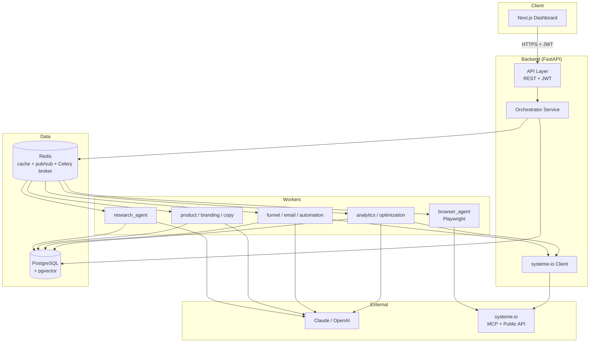
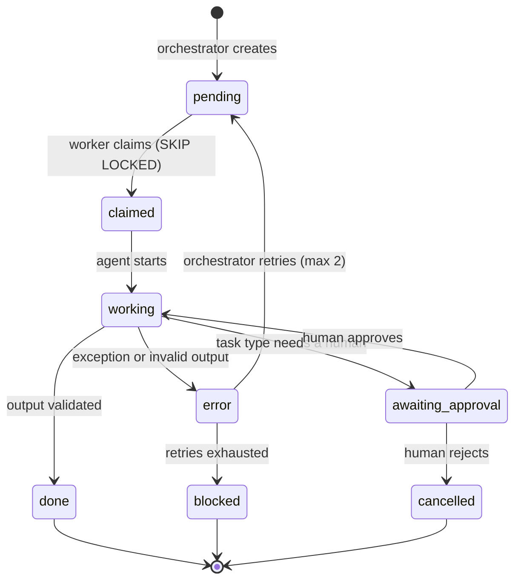
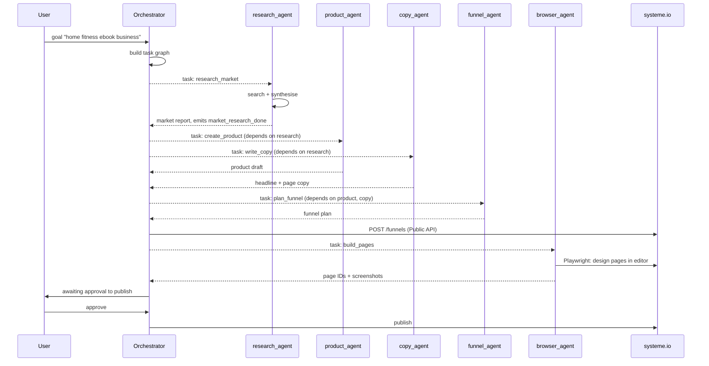
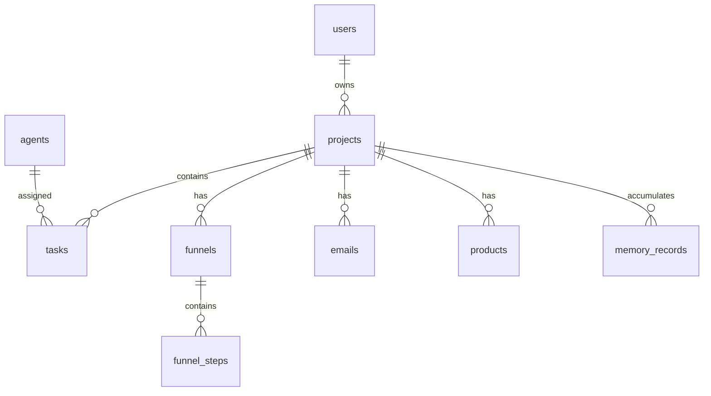

# Architecture

## 1. High-level system



## 2. Components

| Component | Technology | Responsibility |
|---|---|---|
| Dashboard | Next.js 14, Tailwind | Project management, live task view, logs, manual override |
| API layer | FastAPI | Auth, project CRUD, task inspection, approval endpoints |
| Orchestrator | FastAPI service + Redis | Goal decomposition, dependency resolution, retries |
| Agent workers | Python processes | Claim tasks, call the LLM, write outputs |
| Browser agent | Playwright (Python) | UI automation for anything the APIs don't expose |
| Postgres | 16 + pgvector | Structured data and vector memory in one store |
| Redis | 7 | Cache, pub/sub event bus, Celery broker |

**Why pgvector rather than a dedicated vector database**: at this scale, memory rows are joined
against `projects` and `tasks` constantly. One store means one transaction and one backup story.
The `VectorStore` interface in `vector_memory/store.py` exists so this can be swapped for
Chroma or Pinecone without touching agent code, if recall volume ever justifies it.

## 3. Task lifecycle



Tasks are claimed with `SELECT ... FOR UPDATE SKIP LOCKED`, so multiple workers of the same
agent type can run without double-processing. A task becomes claimable only when every id in
its `depends_on` array has status `done`.

## 4. End-to-end flow



## 5. Data model



DDL: [`infra/sql/001_init.sql`](../infra/sql/001_init.sql). Highlights:

- `tasks.input` / `tasks.output` are `JSONB` — agent payloads vary by task type and shouldn't
  force a migration each time one changes.
- `tasks.depends_on` is `INT[]`, checked by the orchestrator before a task becomes claimable.
- `memory_records.embedding` is `VECTOR(1536)` with an IVFFlat cosine index.
- Composite index on `tasks(project_id, status)` — the claim query's hot path.

## 6. Task and event schema

Canonical definitions live in `backend/app/schemas.py`. Task record:

```json
{
  "id": 1024,
  "project_id": 7,
  "task_type": "create_funnel",
  "assigned_to": "funnel_agent",
  "status": "pending",
  "input": { "headline": "AI Productivity Boost", "audience": "small businesses" },
  "output": null,
  "depends_on": [1019, 1020],
  "attempts": 0,
  "created_at": "2026-07-25T18:00:00Z",
  "updated_at": null
}
```

Event on Redis:

```json
{
  "event": "task_completed",
  "task_id": 1024,
  "project_id": 7,
  "agent": "funnel_agent",
  "result": { "funnel_id": 55 },
  "timestamp": "2026-07-25T18:10:00Z",
  "signature": "hmac-sha256:..."
}
```

Every event carries an HMAC signature over the canonical JSON body, keyed by `JWT_SECRET`.
Subscribers reject unsigned or mis-signed events — this is the trust boundary between workers.

## 7. Memory

**Short-term** — the current project's state, in `tasks`, `funnels`, `emails`. An agent's
working context is assembled per task and not persisted beyond it.

**Long-term** — `memory_records`, embedded and searchable across projects:

| Category | Written by | Used for |
|---|---|---|
| `customer_pain` | research | Framing copy against real pains |
| `headline`, `cta` | copy, optimization | Reusing what converted |
| `funnel_pattern` | funnel | Structures that worked per niche |
| `email_performance` | email, analytics | Subject lines that got opened |
| `experiment_result` | optimization | Not re-proposing known losers |
| `brand_style` | branding | Palette and naming consistency |

**Retention** — memory is time-bound by default: records expire after `MEMORY_TTL_DAYS` (365)
unless marked `important`. Users can list and delete their own memory through the dashboard.
Nothing is retained without a project owner.

**Retrieval** — cosine similarity over the same embedding model used at write time. Changing
`EMBEDDING_MODEL` requires a re-index; the model name is stored per row so mixed-model reads are
detectable rather than silently wrong.

## 8. Security model

See [`security.md`](security.md). In short: JWT for users, scoped service tokens for agents,
least privilege per agent toolset, signed inter-agent events, secrets server-side only, and a
hard human-approval gate in front of publishing and payments.

## 9. Deployment

`docker-compose` for local development; Kubernetes manifests in `infra/k8s/` for staging and
production. Each component is its own image: `backend`, `worker`, `browser-agent`, `frontend`.
The browser agent is deliberately a separate deployment — it is heavier, riskier, and needs
different resource limits and a stricter network policy than the rest.
